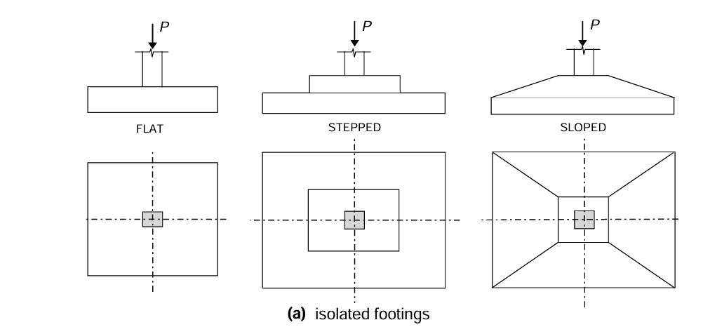

### Theory

Footing design is a critical aspect of structural engineering, ensuring that the loads from the superstructure are safely transmitted to the underlying soil without causing excessive settlement or structural failure.

‘Footings’ belong to the category of shallow foundations (as opposed to deep foundations such as piles and caissons) and are used when soil of sufficient strength is available within a relatively short depth below the ground surface.  Shallow foundations comprise not only footings (which support columns/walls, and have a limited area/width in plan) but also rafts which support multiple columns on a large plan area).  The shallow foundation (footing or raft) has a large plan area in comparison with the cross-sectional area of the column(s) it supports because: 
- the loads on the columns (axial thrust, bending moments‡) are resisted by concrete under compression and reinforcing steel under tension and/or compression, whereas these load effects are transmitted by the footing/raft to a relatively weak supporting soil by bearing pressures alone; 
the ‘safe bearing capacity’ of the soil is very low (100 – 400 kPa) in comparison with the permissible compressive stresses in concrete (5–15 MPa) and steel (130 190 MPa) in a column under service loads.

### Types of Footings:
1) Isolated Footings
2) Combined Footings
3) Wall Footings

### Equilibrium: 
Balancing the applied axial load (Pu) from the column with the upward pressure distribution on the soil (soil bearing pressure).
Soil Properties: The allowable soil bearing capacity (SBC) is a crucial factor. It's the maximum pressure the soil can safely sustain without excessive settlement.
Footing Dimensions: The size of the footing is determined by dividing the applied load (Pu) by the allowable SBC.
Structural Behaviour: The footing slab acts as a flexural element under the applied load, experiencing bending moments and shear forces.
Material Properties: The design considers the compressive strength of concrete (fck) and yield strength of steel reinforcement (fy).

### Design Steps:

##### Define Design Parameters:
Specify the applied axial load (Pu) on the column.
Determine the allowable soil bearing capacity (SBC) from geotechnical investigations.
Choose design values for concrete strength (fck) and steel yield strength (fy) based on material specifications and code requirements.

##### Footing Size Calculation:
Calculate the minimum required area (A) of the footing by dividing the applied load (Pu) by the allowable SBC (Pu = A * SBC).
Considering constructability and potential eccentricity of the load, choose a preliminary rectangular or square footing shape with dimensions (B x L).

##### Check for Bearing Capacity Exceedance: 
Verify the actual bearing pressure (Pu / B x L) on the soil is less than or equal to the allowable SBC.

##### Footing Depth Selection: 
Considering factors like frost depth, drainage requirements, and embedment for stability, select a suitable depth (D) for the footing.

##### Structural Analysis:
Divide the footing into critical sections (typically at the face of the column and mid-span between the column and edges).
Assume a simplified load distribution (e.g., trapezoidal or uniformly distributed load) on the footing based on the column position (centric or eccentric).
Calculate the bending moments and shear forces acting on the critical sections using engineering mechanics principles.

##### Reinforcement Design:
Based on the bending moments and code provisions, calculate the required area of steel reinforcement (Asc) for the footing slab in both directions (longitudinal and transverse).
Select appropriate bar diameter and spacing for the top and bottom reinforcement layers.
Ensure proper concrete cover thickness for durability as specified by building codes.
